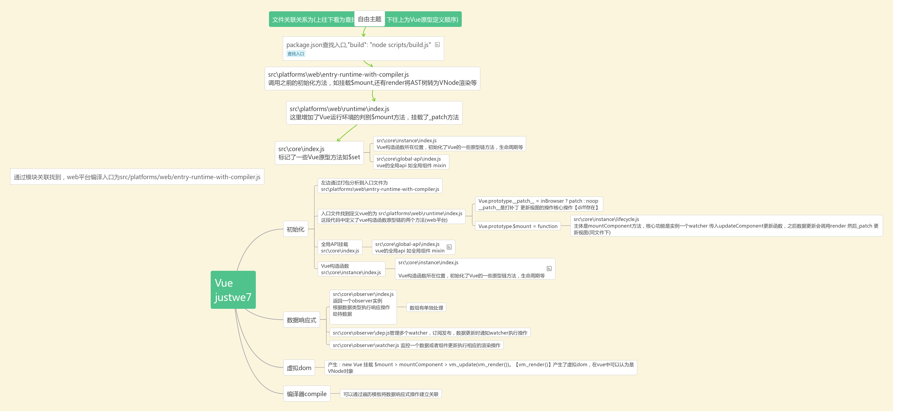

# Vue源码阅读笔记

```
src
├── compiler        # 编译相关 
├── core            # 核心代码 
├── platforms       # 不同平台的支持
├── server          # 服务端渲染
├── sfc             # .vue 文件解析
├── shared          # 共享代码
```

## 断点查看源码

1. 下载项目，执行 `npm i`
2. 安装rollup， `npm i rollup`
3. package.json 修改`"dev": "rollup -w -c scripts/config.js --sourcemap --environment TARGET:web-full-dev",`，添加`--sourcemap`
4. npm run dev
5. 在examples目录下创建自己的html文件，引入vue `<script src="../../dist/vue.js"></script>`，单文件打开调试
6. 浏览器控制台sources找到资源打断点


### 虚拟dom是什么
产生：new Vue 挂载 $mount > mountComponent > vm._update(vm._render())。【vm._render()】产生了虚拟dom，在vue中可以认为是VNode对象

### 大纲
整理一晚上，大概按自己了解列了一下这么🐂🍺项目的设计。有理解错误的地方热心人士看到请帮忙指出一下😂     

