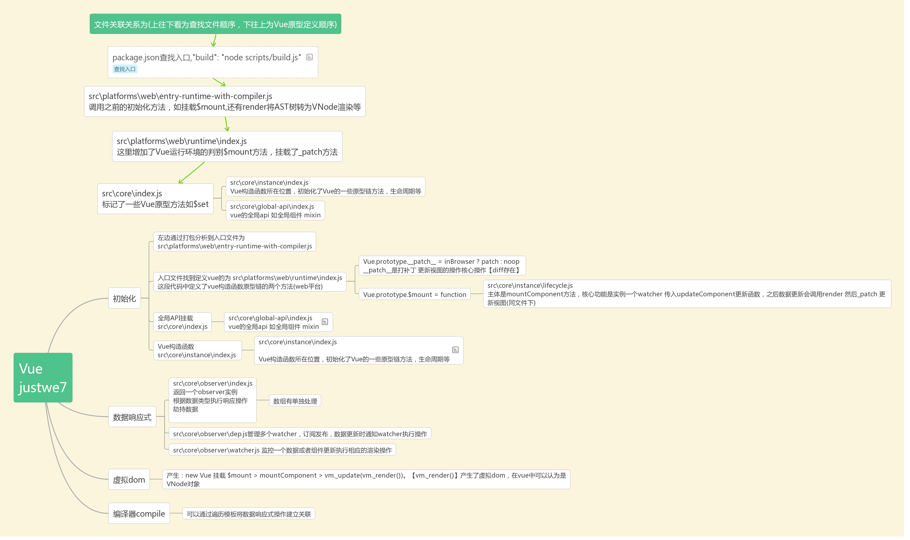

# Vue源码阅读笔记

```
src
├── compiler        # 编译相关 
├── core            # 核心代码 
├── platforms       # 不同平台的支持
├── server          # 服务端渲染
├── sfc             # .vue 文件解析
├── shared          # 共享代码
```

## 断点查看源码

1. 下载项目，执行 `npm i`
2. 安装rollup， `npm i rollup`
3. package.json 修改`"dev": "rollup -w -c scripts/config.js --sourcemap --environment TARGET:web-full-dev",`，添加`--sourcemap`
4. npm run dev
5. 在examples目录下创建自己的html文件，引入vue `<script src="../../dist/vue.js"></script>`，单文件打开调试
6. 浏览器控制台sources找到资源打断点
   
如 `examples\my-test1\index.html` 目录下直接浏览器打开断点调试


### 虚拟dom是什么
产生：new Vue 挂载 $mount > mountComponent > vm._update(vm._render())。【vm._render()】产生了虚拟dom，在vue中可以认为是VNode对象


```js
new Vue之前，首先会初始化Vue构造函数的方法及属性
initMixin(Vue)//初始化vue组件上一些如data created methods watch等 触发生命周期钩子函数：beforeCreate created
stateMixin(Vue)//定义$data $props $set $delete $watch
eventsMixin(Vue)//$on $emit $off $once
lifecycleMixin(Vue)//定义更新 _update $forceUpdate $destory  触发生命周期钩子函数： 'beforeDestroy' , 'destroyed' , 'beforeMount' , 'beforeUpdate' ,'mounted', 'activated' , 'deactivated'
renderMixin(Vue)//render函数 slot createElement调用
```

（web平台）
- new Vue,调用进行数据劫持
- 模板转换ast，ast转为render字符串函数-会生成虚拟dom(VNode)
- mount执行new Function(render字符串)获取虚拟dom
- mountComponent会创建watcher并将更改组件内容的方法updateComponent作为回调传入，根据第一步的getter/setter管理通知watcher响应
- mountComponent => updateComponent最终调用update方法通过VNode生成真实dom
- data的监听多个组件展示watcher使用Dep来管理，订阅和派发

### 理解的思维导图

